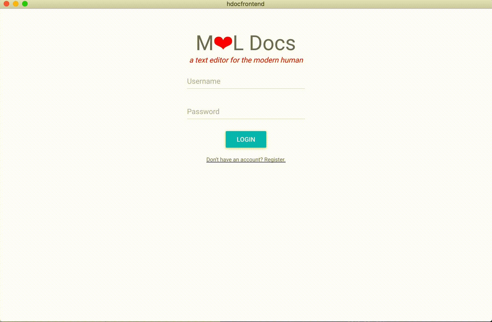

# hdocs2.0
A basic collaborative text editor built with Electron, React, and Material UI on the front end, and node.js, express, mongoDB, and websockets on the back-end.

hdocs2.0 has a basic registration and login flow - user profiles and documents are stored in mongoDB.

Users can create and share files with one another, and see changes in real-time.

To run hdocs2.0 yourself, make sure to install electron, create an env.sh file and add your SERVER_URI and MONGO_URI, and lastly npm run start for the front end and npm run build-dev for the server.

